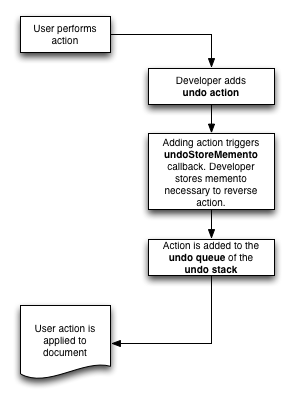
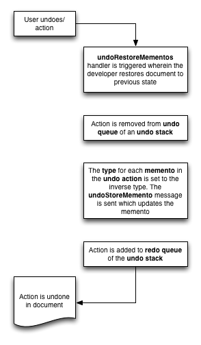

# undo_manager

The Undo Manager is an API that manages an undo/redo queue for your application.

## Contents

* [Activate the Undo Manager framework helper](#activate-the-undo-manager-framework-helper)
* [Important terms](#important-terms)
* [How the Undo Manager works](#how-the-undo-manager-works)
* [API](#api)

## Activate the Undo Manager framework helper

To add the Undo Manager helper to your application add it under the `helpers` section of the `app.yml` file:

```
# app.yml

helpers:
  - folder: ./helpers
  - filename: "[[FRAMEWORK]]/helpers/undo_manager"
```

## Important terms

### Undo stack

An undo stack is a queue of undo actions. An application can have one or more undo stacks depending on the need. For example, an application that supports multiple document editors would use a different undo stack for each document editor window.

### Undo queue

Each undo stack has an undo queue which consists of the undo actions that can be undone. When an undo action is undone it is moved to the redo queue.

### Redo queue

Each undo stack has a redo queue which consists of the undo actions that can be redone. When an undo action is redone it is moved to the undo queue.

### Undo action
An undo action represents an action that the user performed that can be undone or redone. Undo actions are of a specific type and can have a memento associated with them.

### Memento array

A memento array is the array containing the information necessary to reverse an undo action (or at least part of it). Each memento array has at a minimum a `type` key and one other key. A simple memento array containing an id would look like this:

```
local tMementoA

put "delete" into tMementoA["type"]
put 35 into tMementoA["id"]
```

### Memento array types

Each memento array must have a `type` key. The `type` tells the `undoStoreMementos` message what type of memento to store.

By default the Undo Manager defines three types that you can assign to a memento array.

1. `create`
2. `delete`
3. `update`

Each type has an inverse type. When calling `undoUndo` and an undo action is processed the action is moved from the undo queue to the redo queue and the memento array action is changed to the inverse type. This allows the action to be redone. By default the following inverse types are defined:

| Type | Inverse Type |
| --   | --           |
| create | delete |
| delete | create |
| update | update |

### Undo action mementos

Each undo action has a "mementos" property which is a numerically indexed array. Each numeric element is a memento array. The undo action `mementos` key must have at least one memento array. A simple `mementos` key with one memento array would be constructed thusly:

```
local tMementosA, tMementoA

put "delete" into tMementoA["type"]
put 35 into tMementoA["id"]

put tMementoA into tMementosA[1]
```

## How the Undo Manager works

The Undo Manager helper provides an API that coordinates the storing and processing of undo and redo actions in your application. The helper DOES NOT provide the actual logic for performing the undo or redo operation. That job falls upon you the developer as undo actions will be specific to your application.

What the helper does do is manage undo actions. Here is a description of the life of an undo action:

1. When the user performs an action the developer adds an undo action to an undo stack. The undo action has a bare bones `mementos` key associated with it.
2. The `undoStoreMementos` message is dispatched to `the target` when an undo action is added. In the `undoStoreMementos` handler the developer generates the memento(s) necessary to reverse the action. The Undo Manager will store these memento(s) for use later on.
3. When the user chooses to undo an action and `undoUndo` is called the Undo Manager dispatches `undoRestoreMementos` to `the target`. The message handler is responsible for using the undo action's mementos to restore the application to the correct state. The undo action is moved to the redo queue and each memento is assigned the inverse of it's current `type`. E.g. if the memento's type is `create` then it would be set to `delete`.

Here are some diagrams showing what happens when adding an undo action and undoing an action.

### Adding an undo action to an undo stack



### Undoing an action



## Storing mementos

Each time the user performs an action that can be undone the developer adds an undo action to an undo stack. The undo action has one or more mementos associated with it. These mementos are stored in the `mementos` key of an undo action. The `mementos` key is a numerically indexed array where each index is a `memento` array which has the information necessary to reverse the action. For example, if you created a new object then you probably need one memento array that has the information needed to delete that object if the user decides to undo the action.

Mementos for an undo action will be populated primarily in the `undoStoreMementos` handler. However, you do need to provide some basic information about the undo action mementos when you call `undoAddAction`.

An undo action is added to the undo queue using the `undoAddAction` command. The undo action can then be processed when the user undoes or redoes the action. Each time the the user undoes or redoes the action the undo action memento(s) needs to be updated. Because of this need to update the memento(s) throughout the life of the undo action the memento(s) is updated using the `undoStoreMementos` callback.

The `undoStoreMementos` callback is first called by `undoAddAction`. The callback will subsequently be called when calling `undoUndo` and `undoRedo`. The mementos array that you pass to `undoAddAction` should contain the minimum amount of information necessary for `undoStoreMementos` callback to store the actual memento. For example, you could just pass in a reference to a LiveCode control if you are changing properties on the control. The `undoStoreMementos` callback would use the control reference to store the current state of the properties.

## Restoring mementos

When you call `undoUndo` or `undoRedo` then the mementos stored for the most recent undo action will be used to reverse the action in the application. The `undoRestoreMementos` will be dispatched to `the target` and the memento array(s) can be used to update the application state.

## An example

Now that you have a foundational understanding of how the Undo Manager works, let's look at an example.

Here is an example of how you would add a single memento array to an undo action to an undo stack.

```
# Application creates new content. New content id is placed in tContentIds variable
...

# Create the memento array used to reverse the undo action. Since the code is creating content the
# memento array will use the `create` type – you will undo a creation action. Store the minimum amount of information
# that the `undoStoreMementos` callback will need to fill in the memento.
# In this case the callback just needs the id of the content that was created.
local tMementoA, tMementosA

put "create" into tMementoA["type"]
put tContentIds into tMementoA["ids"]

put tMementoA into tMementosA[1]

# Add the undo action with the memento to the undo stack. The label in the Undo menu is "Undo Add Content".
undoAddAction "document 1", "Add Content", tMementosA
```

Now that an undo action has been added to the "document 1" undo stack, let's look at the code that fills in the memento array. The memento is filled in based on the action being performed. As you look at the code below keep in mind that after a user undoes an action the user then has to be able to redo the action. The `undoStoreMementos` callback will need to be able to create mementos for both undo and redo requests. Also note that the `pUndoObjectA` parameter is passed in by reference. The callback will be updating the memento array(s) and the Undo Manager will store any modifications made to the parameter. `pUndoObjectA` will be passed to `undoRestoreMementos` later on.

**Important!** Be aware of when you are calling `undoAddAction` in your code. If the user is deleting an object and you delete the object before calling `undoAddAction` then your application may not be able to generate a memento because the object doesn't exist. In such cases call `undoAddAction` before you delete the object. If an error occurs while deleting the object you can use `undoRemoveLatest` to remove the undo action from the undo stack.

```
command undoStoreMementos pUndoStack, @pMementoAs
  local i

  repeat with i = 1 to the number of elements of pMementosA
    switch pMementosA[i]["type"]
      case "create"
        # Add keys to memento array necessary to undo the create action
        _StoreMementoToUndoCreateAction pMementosA[i]
        break

      case "delete"
        # Add keys to memento array that will be required to undo the delete action
        _StoreMementoToUndoDeleteAction pMementosA[i]
        break

      case "update"
        # Add keys to memento array that will allow the code to restore properties.
        _StoreMementoToUndoUpdateAction pMementosA[i]
        break

    end switch
  end repeat
end undoStoreMementos


private command _StoreMementoToUndoCreateAction @pMementoA
  # TODO: Add keys to pMementoA necessary to delete the content created
end _StoreMementoToUndoCreateAction


private command _StoreMementoToUndoDeleteAction @pMementoA
  # TODO: Add keys to pMementoA that will be required to create the content that was deleted
end _StoreMementoToUndoDeleteAction


private command _StoreMementoToUndoUpdateAction @pMementoA
  # TODO: Add keys to pMementoA that will allow the code to restore properties.
end _StoreMementoToUndoUpdateAction


command undoRestoreMementos pUndoStack, @pMementosA
  # Lock screen so that all UI updates appear at once
  lock screen

  # Use the information in the mementos to reverse the action and update the UI.
  repeat with i = 1 to the number of elements of pMementosA
    switch pMementosA[i]["type"]
      case "create"
        # Undo the create action
        ...
        break

      case "delete"
        # Undo the delete action
        ...
        break

      case "update"
        # Undo the update action
        ...
        break

    end switch
  end repeat

  unlock screen
end undoRestoreMementos
```

**Of interest:** When moving an undo action from the undo queue to the redo queue (or vice versa) the Undo Manager reverses the sequence of elements in the `mementos` array. For example, if you pass in two memento arrays when creating an undo action then key "2" will become key "1" and key "1" will become key "2" when the undo action is moved to the redo queue.

## Adding undo functionality to field edits

The Undo Manager has built in support for edits made during a single field editing session. The undo stack covers any edits made in a field after openField and before closeField/exitField. To turn this feature on call `undoRegisterEditFieldType` when your app starts up. After calling `undoRegisterEditFieldType` any calls to handlers such as `undoCanUndo` and `undoUndo` will automatically target the "edit field" undo stack if the user is currently editing text in a field. Once focus leaves the field then calls to handlers such as `undoCanUndo` will target the specified undo stack.

When undoing changes in a field the `textChanged` message is sent for each memento that is processed in `undoRestoreMementos` (there should only be one memento). In addition, after all mementos have been processed the `EditFieldMementosRestored` message is sent to the field. This is a good place to sync up the UI if your app requires it.

<br>

## API

- [undoRestoreMementos](#undoRestoreMementos)
- [undoStoreMementos](#undoStoreMementos)
- [undoRestoreMementos](#undoRestoreMementos)
- [undoStoreMementos](#undoStoreMementos)- [undoAddAction](#undoAddAction)
- [undoCanRedo](#undoCanRedo)
- [undoCanUndo](#undoCanUndo)
- [undoCleanupStack](#undoCleanupStack)
- [undoGetMaxUndos](#undoGetMaxUndos)
>
- [undoGetNextUndoInStack](#undoGetNextUndoInStack)
- [undoGetTargetForStackCallbacks](#undoGetTargetForStackCallbacks)
- [undoPrintLog](#undoPrintLog)
- [undoRedo](#undoRedo)
- [undoRedoActionName](#undoRedoActionName)
>
- [undoRegisterEditFieldType](#undoRegisterEditFieldType)
- [undoRegisterType](#undoRegisterType)
- [undoRemoveLatest](#undoRemoveLatest)
- [undoReset](#undoReset)
- [undoSetMaxUndos](#undoSetMaxUndos)
>
- [undoSetTargetForStackCallbacks](#undoSetTargetForStackCallbacks)
- [undoUndo](#undoUndo)
- [undoUndoActionName](#undoUndoActionName)


<br>

## <a name="undoRestoreMementos"></a>undoRestoreMementos

**Type**: command

**Syntax**: `undoRestoreMementos <pUndoStack>,<pMementosA>`

**Summary**: Restores mementos for a field edit.


<br>

## <a name="undoStoreMementos"></a>undoStoreMementos

**Type**: command

**Syntax**: `undoStoreMementos <pUndoStack>,<pMementosA>`

**Summary**: Stores a memento for a field prior to changes being made.


## <a name="undoRestoreMementos"></a>undoRestoreMementos

**Type**: command

**Syntax**: `undoRestoreMementos <pUndoStack>,<pMementosA>`

**Summary**: Restores mementos for a field edit.


<br>

## <a name="undoStoreMementos"></a>undoStoreMementos

**Type**: command

**Syntax**: `undoStoreMementos <pUndoStack>,<pMementosA>`

**Summary**: Stores a memento for a field prior to changes being made.


## <a name="undoAddAction"></a>undoAddAction

**Type**: command

**Syntax**: `undoAddAction <pUndoStack>,<pActionName>,<pMementosA>`

**Summary**: Adds an undo action to an undo stack.

**Returns**: The array representing the undo action that was created.

**Parameters**:

| Name | Description |
|:---- |:----------- |
| `pUndoStack` |  The name of the undo stack to associate the action with. If empty then the undo stack is "default". |
| `pActionName` |  The name of the undo action. This is what you will display in the Edit > Undo/Redo menus. |
| `pMementosA` |  A numerically indexed array of memento arrays for this action. |

**Description**:

Use this handler to add undo actions to an undo stack in your application.

```
local tMementoA, tMementosA

put tId into tMementoA["id"]
put tIndex into tMementoA["index"]

put tMementoA into tMementosA[1]

undoAddAction "document 1", "Create thing", tMementosA
```


<br>

## <a name="undoCanRedo"></a>undoCanRedo

**Type**: function

**Syntax**: `undoCanRedo(<pUndoStack>)`

**Summary**: Returns true if there is a redo action.

**Returns**: Boolean

**Parameters**:

| Name | Description |
|:---- |:----------- |
| `pUndoStack` |  The name of the undo stack to target. Leave empty for "default" |

<br>

## <a name="undoCanUndo"></a>undoCanUndo

**Type**: function

**Syntax**: `undoCanUndo(<pUndoStack>)`

**Summary**: Returns true if there is an undo action.

**Returns**: Boolean

**Parameters**:

| Name | Description |
|:---- |:----------- |
| `pUndoStack` |  The name of the undo stack to target. Leave empty for "default" |

<br>

## <a name="undoCleanupStack"></a>undoCleanupStack

**Type**: command

**Syntax**: `undoCleanupStack <pUndoStack>`

**Summary**: Removes all undo entries for a particular owner.

**Returns**: empty

**Parameters**:

| Name | Description |
|:---- |:----------- |
| `pUndoStack` |  The undo stack to target. |

<br>

## <a name="undoGetMaxUndos"></a>undoGetMaxUndos

**Type**: function

**Syntax**: `undoGetMaxUndos()`

**Summary**: Returns the maximum number of undo actions that are stored in an undo stack.

**Returns**: Number of undo entries to store

<br>

## <a name="undoGetNextUndoInStack"></a>undoGetNextUndoInStack

**Type**: function

**Syntax**: `undoGetNextUndoInStack(<pUndoStack>)`

**Summary**: Returns the undo structure for the next undo in the stack.

**Returns**: Array or empty

**Parameters**:

| Name | Description |
|:---- |:----------- |
| `pUndoStack` |  The undo stack to target. |

**Description**:

Use this for comparisons to determine if a new undo action should be added to the stack
(e.g. actions that repeat but you only want 1 undo for).

<br>

## <a name="undoGetTargetForStackCallbacks"></a>undoGetTargetForStackCallbacks

**Type**: function

**Syntax**: `undoGetTargetForStackCallbacks(<pUndoStack>)`

**Summary**: Returns the target that messages are sent to for an undo stack.

**Returns**: Object reference

**Parameters**:

| Name | Description |
|:---- |:----------- |
| `pUndoStack` |  The undo stack of interest. |

<br>

## <a name="undoPrintLog"></a>undoPrintLog

**Type**: function

**Syntax**: `undoPrintLog()`

**Summary**: Prints the undo log array. Use for troublehsooting.

**Returns**: text representation of internal array

<br>

## <a name="undoRedo"></a>undoRedo

**Type**: command

**Syntax**: `undoRedo <pUndoStack>`

**Summary**: Performs an redo operation for the last redo added to the stack.

**Returns**: empty or "can't redo"

**Parameters**:

| Name | Description |
|:---- |:----------- |
| `pUndoStack` |  The undo stack to target. |

<br>

## <a name="undoRedoActionName"></a>undoRedoActionName

**Type**: function

**Syntax**: `undoRedoActionName(<pUndoStack>)`

**Summary**: Returns the next redo action name in a stack.

**Returns**: String

**Parameters**:

| Name | Description |
|:---- |:----------- |
| `pUndoStack` |  The undo stack to target. |

**Description**:

The action name that was assigned when calling undoAddAction.

<br>

## <a name="undoRegisterEditFieldType"></a>undoRegisterEditFieldType

**Type**: command

**Syntax**: `undoRegisterEditFieldType `

**Summary**: Registers the "edit field" undo stack for use while a user is editing text in a field.

**Returns**: empty

**Description**:

Thie handler registers the "edit field" undo stack and inserts a frontscript into the message path.
The frontscript monitors edits made in a field while it has focus. Undo/redo affects typing done before focus
is removed from the field.

<br>

## <a name="undoRegisterType"></a>undoRegisterType

**Type**: command

**Syntax**: `undoRegisterType <pType>,<pInverseType>`

**Summary**: Registers an undo type with the Undo Manager.

**Returns**: empty

**Parameters**:

| Name | Description |
|:---- |:----------- |
| `pType` |  The type to register. |
| `pInverseType` |  When calling undoUndo the type of the undo action will be set to
this value. For example, if pType is "create" then this might be
"delete". Leave empty  if there is no inverse type. If this value is
different then pType then make sure you register this type as well. |

**Description**:

When adding an undo entry to an undo stack, you specify a type.
The type helps the application know how to undo or redo the action.
Each type has callbacks that will be triggered when that type of undo entry
needs to be undone or redone.


<br>

## <a name="undoRemoveLatest"></a>undoRemoveLatest

**Type**: command

**Syntax**: `undoRemoveLatest <pUndoStack>`

**Summary**: Removes the last added undo action from the undo stack.

**Returns**: empty

**Parameters**:

| Name | Description |
|:---- |:----------- |
| `pUndoStack` |  The undo stack to target. |

<br>

## <a name="undoReset"></a>undoReset

**Type**: command

**Syntax**: `undoReset <pUndoStack>`

**Summary**: Resets an undo stack.

**Returns**: empty

**Parameters**:

| Name | Description |
|:---- |:----------- |
| `pUndoStack` |  The undo stack to target. |

**Description**:

Cleanup callbacks will be sent for any undo actions in the stack.


<br>

## <a name="undoSetMaxUndos"></a>undoSetMaxUndos

**Type**: command

**Syntax**: `undoSetMaxUndos <pMax>`

**Summary**: Sets the maximum number of undo actions that will be saved in an undo stack.

**Returns**: empty

**Parameters**:

| Name | Description |
|:---- |:----------- |
| `pMax` |  The maximum number of undo entries to store. |

<br>

## <a name="undoSetTargetForStackCallbacks"></a>undoSetTargetForStackCallbacks

**Type**: command

**Syntax**: `undoSetTargetForStackCallbacks <pUndoStack>,<pTarget>`

**Summary**: Sets the target for undo type callbacks for an undo stack.

**Returns**: empty

**Parameters**:

| Name | Description |
|:---- |:----------- |
| `pUndoStack` |  The undo stack to target. |
| `pTarget` |  The target object for messages. |

**Description**:

If a callback target control is set for an undo stack then any undo type
which doesn't specify a contorl will send to the undo stack control.


<br>

## <a name="undoUndo"></a>undoUndo

**Type**: command

**Syntax**: `undoUndo <pUndoStack>`

**Summary**: Performs an undo operation for the last undo added to the stack.

**Returns**: empty or "can't undo"

**Parameters**:

| Name | Description |
|:---- |:----------- |
| `pUndoStack` |  The undo stack to target. |

<br>

## <a name="undoUndoActionName"></a>undoUndoActionName

**Type**: function

**Syntax**: `undoUndoActionName(<pUndoStack>)`

**Summary**: Returns the next undo action name in a stack.

**Returns**: String

**Parameters**:

| Name | Description |
|:---- |:----------- |
| `pUndoStack` |  The undo stack to target. |

**Description**:

The action name that was assigned when calling undoAddAction.


